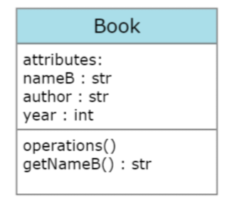
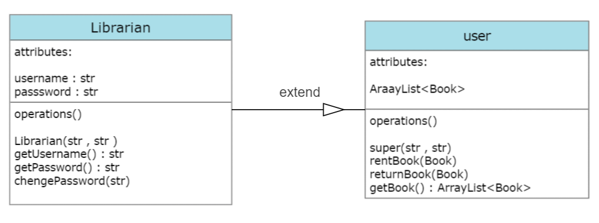
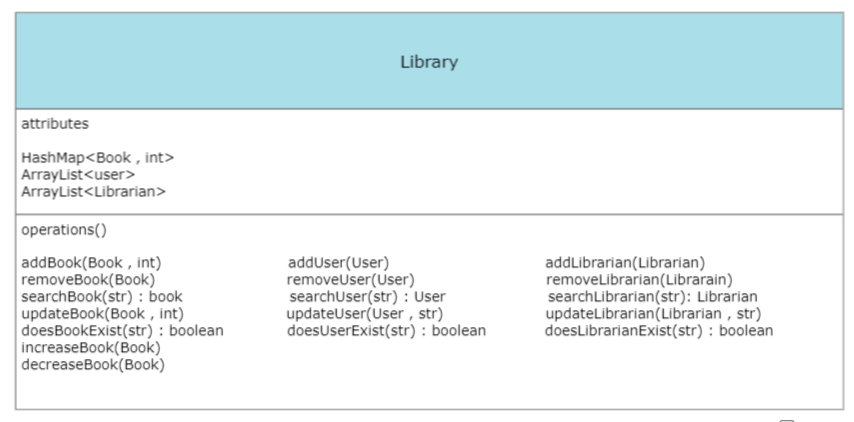

# fourth assignment report

## navid ebadi 401222093

## Introduction:
- Creating a app for a library with features such as borrowing books and returning them for each specific user and adding, deleting and updating books, users and librarians by a specific librarian.

## Design and Implementation:
- classes:
    - 
    - 
    - 
- main:
    - In the main class, we first define some books, 2 users and 1 librarian
    - In the runMenu method, we set up a while loop that the entire project works with and stops only when the operation is done correctly.

## Testing and Evaluation:
- firrs test
    1. 1
    2. puria
    3. 1234pe
    4. 1
    5. gobletOfFire

- second test
    1. 2
    2. navid
    3. 1357na
    4. 1
    5. The Fellowship of the Ring
    6. J. R. R. Tolkien
    7. 1954
    8. 12
## Conclusion:
    - For further development of the program, more practical conditions can be placed in the while loop